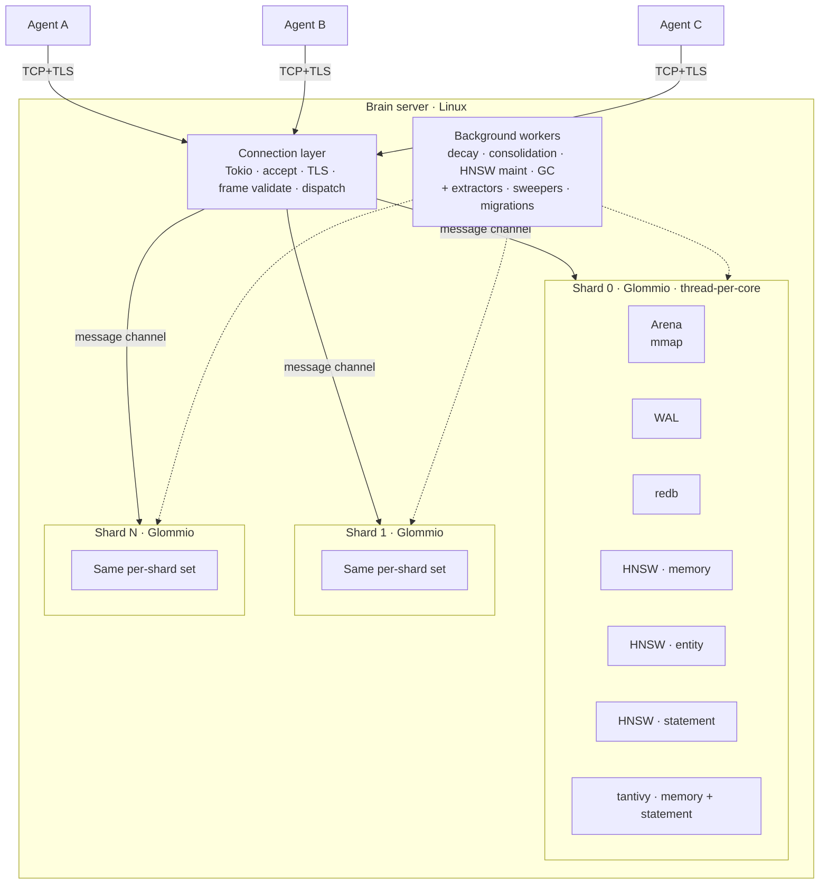
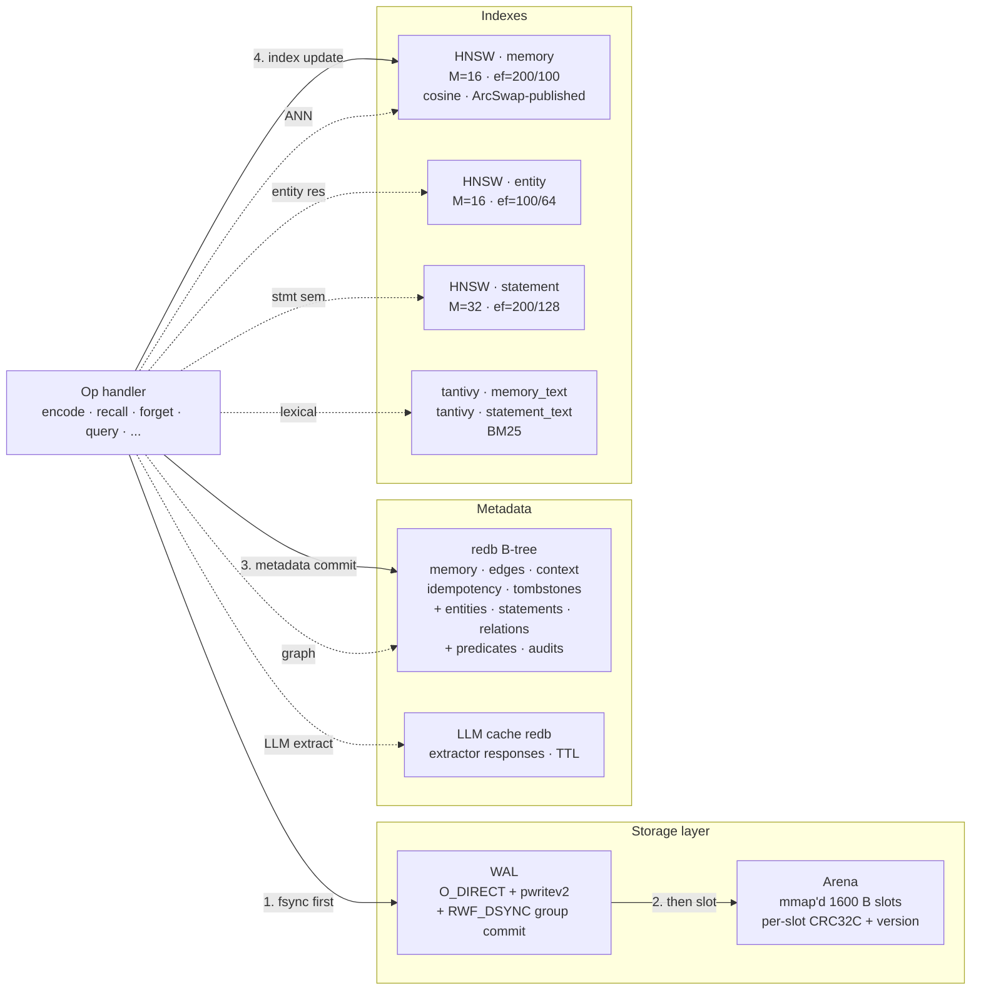

<p align="center">
  
</p>

# Brain

> A memory database for AI agents — vector memory, a typed graph (entities + statements + relations), and hybrid retrieval, in one Rust core. `encode` / `recall` / `plan` / `reason` / `forget` are the primitive operations; the typed graph activates when a schema is declared.

**Status:** Pre-release (**v0.1.0**). Brain has no external users; the wire protocol, redb tables, and schema model are still in flux. The v1.0 release ships when the combined acceptance suite at [`spec/19_benchmarks/06_complete_acceptance.md`](spec/19_benchmarks/06_complete_acceptance.md) passes — functional + performance + storage + operational + schemaless tests, end-to-end.

```text
$ brain
─────────────────────────────────────────────────────────────────────────────
  ◉ brain-shell  v0.1.0  ·  connected to 127.0.0.1:9090

  agent       agent-019e433e
              019e433e-9272-7e70-b071-4a4fd6135d1e
              auto-minted on first run · stored at ~/.config/brain/config.toml

  Type `help` for commands, `quit` to exit.
─────────────────────────────────────────────────────────────────────────────

# 1. Substrate-only: encode an experience, recall what's relevant.
brain> encode "Had a difficult conversation with Alex about the project"
  ✓ ENCODED                                          LSN 1 · s1/m1/v1 ·  9 ms
  content   "Had a difficult conversation with Alex about the project"
  type      episodic      salience  0.50      context  0

brain> recall "conflicts with Alex" --top-k 5
  # → ranked by semantic similarity, edge proximity, temporal recency,
  #   and salience — not just vector distance.

# 2. Once a schema is declared (today via the SDK), the knowledge layer
#    comes alive — subsequent encodes go through pattern → classifier →
#    LLM extractors, producing typed entities, statements, and relations.
brain> encode "Priya kicked off the billing rewrite project today"
  ✓ ENCODED                                          LSN 2 · s1/m2/v1 · 11 ms
  → next    subscribe --start-lsn 3   to watch for extraction

# 3. Hybrid retrieval is transparent: with a schema declared, RECALL
#    routes through semantic + lexical + graph retrievers, RRF-fused.
brain> recall "what's Priya working on?" --include-graph
```

---

## Table of contents

- [What Brain is](#what-brain-is)
- [Why this exists](#why-this-exists)
- [The two layers](#the-two-layers)
- [The cognitive primitives](#the-cognitive-primitives)
- [The knowledge layer](#the-knowledge-layer)
- [End-to-end: what `brain.encode("…")` actually does](#end-to-end-what-brainencode-actually-does)
- [Architecture](#architecture)
  - [System layers](#system-layers)
  - [Inside a shard](#inside-a-shard)
  - [The wire protocol](#the-wire-protocol)
- [The seven invariants](#the-seven-invariants)
- [Latency targets](#latency-targets)
- [Tech stack](#tech-stack)
- [Implementation status](#implementation-status)
- [Development environment](#development-environment)
- [Repository layout](#repository-layout)
- [License](#license)

---

## What Brain is

Brain is to AI agents what SQL is to applications: a substrate where the application says *what* it wants cognitively and the substrate handles *how*.

Today, building memory for an LLM agent typically looks like: glue a vector database for similarity, a graph database for relationships, a full-text store for keyword matching, an LLM extraction pipeline, an embedding service, a key-value store for state, a queue for async events, and write a thousand lines of orchestration to keep them in sync. Half of that orchestration is reinventing transaction semantics across systems that don't agree on what "committed" means.

Brain collapses that stack into one substrate:

- A **memory** is the atomic record — text, embedding, salience, time, edges, provenance — stored once and queried many ways.
- A **schema** (optional) declares the entity types, predicates, and relation types the user cares about. The substrate runs three tiers of extractors over incoming memories and surfaces typed entities, statements (Fact / Preference / Event), and relations.
- Recall isn't `top-k by cosine` — it's similarity *blended with* recency, salience, edge proximity, and typed filters, with a hybrid retriever that fuses semantic + lexical + graph ranks via RRF.

## Why this exists

Three observations drove the design:

1. **Agents need cognitive operations, not storage operations.** "Remember this," "what's relevant?", "plan a path," "why do we think X?" map awkwardly onto INSERT / SELECT / JOIN. They map cleanly onto verbs that already carry the semantics: encode, recall, plan, reason, forget.

2. **The data has structure, but it's latent.** An agent's stream of observations contains people, projects, decisions, preferences — but a vector database flattens that to similarity scores. A property graph captures the structure but doesn't help you find anything by meaning. You need both, with a query layer that can join them.

3. **Predictable tail latency is non-negotiable.** Agents call the memory system on every turn. A p99 spike at 200 ms turns into perceived agent latency of seconds. Brain is built thread-per-core (Glommio + `io_uring`), with WAL group-commit, lock-free reads, and a single-writer-per-shard discipline — for tail-latency reasons, not throughput.

## The two layers

Brain ships in two layers that share one shard, one storage system, and one wire protocol:

```
                           ┌───────────────────────────────────────────┐
                           │  KNOWLEDGE LAYER   (activates on schema)  │
                           │                                           │
   Layer 3:  STATEMENTS    │  Facts, Preferences, Events               │
                           │  (typed claims, with provenance + conf.)  │
                           │           ▲                               │
                           │           │ derived from                  │
   Layer 2:  ENTITIES +    │           │                               │
             RELATIONS     │  Canonical nouns, typed edges             │
                           │           ▲                               │
                           │           │ references / anchored to      │
                           └───────────│───────────────────────────────┘
                           ┌───────────│───────────────────────────────┐
   Layer 1:  MEMORIES      │           │                               │
             (substrate)   │  Raw episodic / semantic / consolidated   │
                           │  memories, embedded, indexed in HNSW      │
                           │                                           │
                           │           SUBSTRATE  (always active)      │
                           └───────────────────────────────────────────┘
```

- **Substrate-only mode** (no schema declared): Brain runs as a pure vector memory store. The wire surface is the 8 cognitive primitives. Knowledge-layer tables exist on disk but are empty; knowledge-layer workers don't run. This is a first-class deployment posture, not a legacy mode.

- **Schema-declared mode**: a `SCHEMA_UPLOAD` activates the knowledge layer. Background extractors (pattern → classifier → LLM) run over incoming memories. Entities, statements, and relations populate the knowledge-layer tables and indexes. `RECALL` transparently routes through the hybrid retriever; the typed knowledge SDK becomes useful.

A deployment can move in either direction. Declaring a schema after months of substrate-only use kicks off a backfill. Stopping schema operations returns the substrate to vector-only mode without losing knowledge data.

## The cognitive primitives

Eight verbs at the substrate level (spec [§09](spec/05_operations/00_purpose.md)):

| Verb | What it does |
|---|---|
| **ENCODE** | Store an experience. Brain embeds the text, picks a slot in the arena, writes the WAL record, updates redb metadata, inserts into HNSW, and (if a schema is declared) queues extractors. |
| **RECALL** | Find memories relevant to a cue. Ranks by similarity *blended with* salience, recency, and edge proximity. With a schema declared, routes through the hybrid retriever. |
| **PLAN** | Construct a path from one cognitive state to another. Pull-based executor with budgets (steps, wall time, branches). |
| **REASON** | Multi-hop traversal explaining why X is connected to Y. Returns the path, the evidence memories, and the confidence. |
| **FORGET** | Soft (mark as forgotten; grace period) or hard (zero the slot immediately) tombstoning. Cascades to derived knowledge-layer records when a schema is active. |
| **LINK / UNLINK** | Manually assert / retract a typed edge between two memories. |
| **SUBSCRIBE** | Stream events: memory created, statement created, extractor failed, schema updated, etc. |

One-shot mode (each invocation runs a single verb and exits):

```text
$ brain encode "Alex pushed the deadline to next Friday" \
    --edge followed-by:s1/m17/v1
─────────────────────────────────────────────────────────────────────────────
  ✓ ENCODED                                          LSN 42 · s1/m18/v1 · 8 ms

  content   "Alex pushed the deadline to next Friday"
  type      episodic      salience  0.50      context  0
  edges     0 auto · 1 explicit · 1 total
─────────────────────────────────────────────────────────────────────────────

$ brain recall "when did Alex change the deadline?" --top-k 5 --include-text
  # ranked table of memories, blended by similarity + salience + recency
  # + edge proximity. Pipe `-o json` for machine-readable output.

$ brain plan "current sprint state" "feature shipped" \
    --max-steps 8 --max-wall-time-ms 1000
  # streamed plan steps, each with its text + confidence.

$ brain forget s1/m18/v1 --mode soft
  # tombstones the memory; grace window before reclamation (spec §02/06).
```

Or do the same inside the REPL — same verbs, no `brain` prefix:

```text
brain> encode "Alex pushed the deadline to next Friday" --edge followed-by:s1/m17/v1
brain> recall "when did Alex change the deadline?" --top-k 5 --include-text
brain> plan "current sprint state" "feature shipped" --max-steps 8
brain> reason "Alex changed the deadline" --depth 3
brain> forget s1/m18/v1 --mode soft
brain> subscribe --kind episodic --collect 10
```

Encoding the same content twice is a no-op by default (dedup-on; pass
`--allow-duplicate` if you genuinely want a second copy):

```text
brain> encode "Alex pushed the deadline to next Friday"
  ⟳ DEDUP HIT                                              matched · s1/m18/v1
  match     same content in context 0
  × no fresh write — nothing to do
```

`brain <verb> --help`, `brain> <verb> --help`, and `brain> help <verb>`
all render the same per-verb help card — pick whichever feels natural.

## The knowledge layer

When a schema is declared, the substrate exposes typed cognition. Three layers, ten decisions, one set of guarantees.

**The decisions** (spec [§14–§31](spec/02_data_model/00_purpose.md)):

1. **Property graph, not RDF.** Operational knowledge graphs converged on property graphs; RDF reification is too expensive for fact-with-metadata workloads.
2. **Three statement kinds, shared storage.** Fact / Preference / Event are distinct in the API (different mutation rules) but one table with a `kind` discriminator. Cross-kind queries work; per-kind queries are fast.
3. **Three retrievers + three filters + RRF fusion.** Semantic (HNSW) + Lexical (tantivy BM25) + Graph (entity-joined) for retrieval; Type + Temporal + Confidence for filtering; Reciprocal Rank Fusion (`k=60`) for combining ranks.
4. **Three extractor tiers.** Pattern (regex, free) → Classifier (small bundled model, cheap) → LLM (expensive, capable). Tiered fallback keeps cost manageable.
5. **Declarative schema DSL.** Users declare entity types, relation types, predicates, and extractor bindings. The substrate picks the right extractor tier per declaration. Schema is versioned; data migrates.
6. **Valid time only (v1).** `valid_from` / `valid_to` on statements and relations. Transaction-time "as of" queries are deferred.
7. **Confidence is first-class.** Every derived record has confidence in `[0,1]` and an evidence list. Contradictions surface, don't auto-resolve.
8. **Schema is optional.** No-schema runs as a pure vector substrate (real deployment posture, not legacy).
9. **Single node, single schema namespace.** No federation, no multi-tenant schemas — one Brain, one knowledge graph.
10. **No silent failures.** Schema-validated outputs only; ambiguous resolutions queue for review; contradictions surface; FORGET cascades audited.

**The wire surface** (spec [§28](spec/28_knowledge_wire_protocol/00_purpose.md)) adds ~30 opcodes on top of the substrate's primitives:

| Range | Group | Examples |
|---|---|---|
| `0x20–0x2F` | Schema | SCHEMA_UPLOAD, SCHEMA_GET, EXTRACTOR_LIST, EXTRACTOR_DISABLE |
| `0x30–0x3F` | Entities | ENTITY_CREATE, ENTITY_RESOLVE, ENTITY_MERGE, ENTITY_RENAME |
| `0x40–0x4F` | Statements | STATEMENT_CREATE, STATEMENT_SUPERSEDE, STATEMENT_HISTORY |
| `0x50–0x5F` | Relations | RELATION_CREATE, RELATION_TRAVERSE (1–3 hop), RELATION_LIST_FROM |
| `0x60–0x6F` | Query | QUERY (hybrid), QUERY_EXPLAIN, QUERY_TRACE, RECALL_HYBRID |
| `0x70–0x7F` | Admin | ADMIN_BACKFILL, ADMIN_LIST_PENDING_RESOLUTIONS, ADMIN_LIST_STALE_STATEMENTS |

**End-to-end** ([`docs/development/usage/practical-guide.md`](docs/development/usage/practical-guide.md) walks through this in full):

```
ENCODE "Priya kicked off the billing rewrite today."
  │
  ▼  Substrate writes memory + embedding + WAL + HNSW.
  │
  ├─→ Pattern extractor (sync, regex):
  │     "Priya" → entity_resolver: tier 1 exact hit on existing entity_42
  │     "billing rewrite" → tier 2 fuzzy → create new entity_71 (Project)
  │
  ├─→ Classifier extractor (NER, near-foreground): confirms Person + Project tags.
  │
  ├─→ LLM extractor (async worker, cached): produces Event(Priya, kicked_off,
  │     billing rewrite, event_at=today, confidence=0.91, evidence=[memory_id]).
  │
  ▼
Statement and Relation written; tantivy + statement HNSW indexed.
Audit entries written. Subscribers notified.

LATER: QUERY "What's Priya working on right now?"
  │
  ▼  Query router classifies: known entity "Priya" → graph lane; known
  │  predicate-shape "working on" → type filter (Event/Fact).
  │
  ├─→ GraphRetriever: statements where subject=entity_42, status=current
  ├─→ SemanticRetriever (HNSW): statements similar to query text
  └─→ LexicalRetriever (tantivy BM25): statements with matching tokens
  │
  ▼  RRF fusion (k=60), confidence filter ≥ 0.5, temporal filter (last 30 days)
  │
  ▼
Result: top-N statements with provenance trail back to source memories.
```

## End-to-end: what `brain.encode("…")` actually does

```mermaid
sequenceDiagram
    autonumber
    participant App as Agent app
    participant SDK as brain-sdk
    participant Conn as Connection layer<br/>(Tokio)
    participant Shard as Shard executor<br/>(Glommio)
    participant Embed as Embedding<br/>(BGE-small via candle)
    participant WAL as WAL<br/>(O_DIRECT + RWF_DSYNC)
    participant Arena as Arena<br/>(mmap'd 1600-byte slots)
    participant Meta as Metadata<br/>(redb)
    participant Index as ANN index<br/>(HNSW in RAM)
    participant Ext as Extractor pipeline<br/>(if schema declared)

    App->>SDK: encode("Alex said the deadline...")
    SDK->>SDK: build ENCODE_REQ frame<br/>(rkyv payload + 32B header + CRC)
    SDK->>Conn: TCP write (single frame, EOS)
    Conn->>Conn: validate frame, lookup shard<br/>by agent then shard_id
    Conn->>Shard: enqueue(EncodeRequest)
    Shard->>Embed: embed(text)
    Embed-->>Shard: f32 vector dim 384, L2-normalized
    Shard->>Shard: idempotency, dedup on RequestId
    Shard->>WAL: append(EncodeMemory record)
    WAL->>WAL: pwritev2(RWF_DSYNC)<br/>group commit
    WAL-->>Shard: Lsn (durable)
    Shard->>Arena: write slot(version, vector, metadata)<br/>plus slot CRC
    Shard->>Meta: redb txn,<br/>memory plus edges plus idempotency
    Meta-->>Shard: txn committed
    Shard->>Index: insert(memory_id, vector)
    Shard-->>Conn: ENCODE_RESP(memory_id, salience, was_dedup)
    Conn-->>SDK: TCP write
    SDK-->>App: Memory { id, salience, ... }
    Note over Shard,Ext: After response: pattern extractors run sync;<br/>classifier + LLM run as background workers.
    Shard-)Ext: dispatch (if schema declared)
```

The order matters. Step 5 (WAL fsync) is what makes the operation durable; the response is *not* sent until that fsync returns. Steps 6–9 happen after but before the response — if any of them fail, the WAL record is the source of truth and recovery replays it. This is the "WAL-before-acknowledge" invariant. Knowledge-layer extraction runs *after* the response is sent, so substrate-write latency is unaffected.

## Architecture

### System layers



Two runtimes, one host:

- **Connection layer** runs on **Tokio**. Many lightweight tasks: accept TCP, terminate TLS, decode the 32-byte frame header, validate, dispatch to the right shard via a bounded message channel. Tokio is great here — many tasks, varied shapes, async I/O.
- **Shard layer** runs on **Glommio**. Thread-per-core, `io_uring`, single-task-per-shard for the writer. Each shard owns its files, its indexes, its caches. No cross-shard locks. Reads use `ArcSwap` + `crossbeam-epoch` for lock-free hot paths.

The two layers communicate via channels carrying *messages* (plain `Send` structs). Per-shard data never crosses the boundary; the connection task hands off an `EncodeRequest`, the shard hands back an `EncodeResponse`.

Sharding is by agent (`AgentId → ShardId`), so every operation for an agent goes to one shard. That makes the shard's discipline easy to reason about: one writer, no locks needed, no cross-shard coordination on the hot path.

**Background workers** keep the substrate healthy: salience decay over time, consolidation (multiple similar memories → one summary), HNSW link maintenance, slot reclamation past the tombstone grace window, idempotency-table TTL expiry, and so on. When a schema is declared, additional workers run: pattern + classifier + LLM extractors, the statement-embedding worker, the supersession sweeper, the backfill worker, the schema-migration runner. Workers run as their own Glommio tasks, scheduled around the per-shard writer with priorities (spec [§11](spec/15_background_workers/00_purpose.md) + [§27](spec/27_knowledge_workers/00_purpose.md)).

### Inside a shard



Six data structures per shard, each pinned to a spec section:

- **Arena** ([`spec/05/02`](spec/08_storage/02_arena_layout.md)) — memory-mapped file of 1600-byte slots. Each slot is 1536 bytes of `f32` vector (384 × 4) plus 64 bytes of metadata (kind, salience, timestamps, slot version, CRC). The file has a 4 KiB header recording the shard UUID, format version, slot count, embedding-model fingerprint, and a header CRC. Vectors are little-endian on disk.
- **WAL** ([`spec/05/04..08`](spec/08_storage/04_wal_overview.md)) — append-only log of operations, one segment per ~64 MiB. Writes use `O_DIRECT` for predictable latency and `pwritev2(RWF_DSYNC)` for durable fsync; the WAL also batches concurrent writes via group commit so N pending records share one fsync. Recovery replays from the last checkpoint forward, tolerating torn-tail (the last record may be partial; we stop there). Knowledge-layer additions add frame types `0x10..0x50` for entity / statement / relation / schema / audit records (spec [§26](spec/26_knowledge_storage/00_purpose.md)).
- **redb** ([`spec/07`](spec/10_metadata/02_table_layout.md) + [`spec/26`](spec/26_knowledge_storage/00_purpose.md)) — embedded B-tree for metadata. Substrate tables: text bodies, edge lists, context names, idempotency dedupe, tombstones. Knowledge-layer tables: entities (+ aliases, trigrams, mentions), statements (+ chain, indexes by subject/predicate/object/event-time), relations (+ direction indexes), predicates, entity types, relation types, extractors, schema versions, audits, merge log. ACID transactions wrap multi-table writes from a single op.
- **HNSW (memory)** ([`spec/06`](spec/09_indexing/01_hnsw_basics.md)) — Hierarchical Navigable Small World index for ANN search over memory vectors. `M=16`, `ef_construction=200`, cosine distance over L2-normalized 384-dim vectors. Held in RAM; persisted incrementally; published to readers via `ArcSwap`.
- **HNSW (entity + statement)** (spec [§26](spec/26_knowledge_storage/00_purpose.md)) — smaller HNSW for entity embeddings (used by the entity resolver) and a separate HNSW for statement embeddings (used by the semantic retriever to find statements similar to a query).
- **tantivy** (spec [§26](spec/26_knowledge_storage/00_purpose.md)) — two per-shard BM25 indexes: one over memory text, one over statement text representations. Backs the lexical retriever in hybrid queries.

The discipline that makes this work without per-record locking:

1. **Single writer per shard.** Only one task mutates shard state. Other Glommio tasks may *read* via `ArcSwap`-published snapshots (HNSW) or via the mmap (arena, redb). The writer never blocks on a lock because there's nobody to lock against.
2. **WAL-before-ack.** Step 1 in the diagram: the WAL append + fsync happens before any other store is touched. If the process dies at step 2, the WAL record on restart drives the rest.
3. **CRC on every slot, every record.** Two checksums: arena slot CRC32C catches in-flight slot corruption; WAL record CRC32C catches log corruption. Both halt the shard on mismatch — never overwrite a stored CRC.

### The wire protocol

Brain ships a custom binary protocol over TCP (with optional TLS). The 32-byte frame header is fixed; the payload is rkyv-encoded structured data plus optional raw `f32` vector blobs.

```text
 Frame header (32 bytes, big-endian)
+--------+--------+--------+--------+
| magic = "BRN0"                     |
+--------+--------+--------+--------+
| ver(1) | op(1)  | flags  (2)      |
+--------+--------+--------+--------+
| header_crc32c (4)                  |
+--------+--------+--------+--------+
| stream_id (4)                      |
+--------+--------+--------+--------+
| payload_len (3) | reserved(1)      |
+--------+--------+--------+--------+
| payload_crc32c (4)                 |
+--------+--------+--------+--------+
| reserved (8)                       |
+--------+--------+--------+--------+

 Payload layout
+----------------------------------+
| rkyv-encoded body                 |  — request/response/event struct
+----------------------------------+
| padding (0–3 bytes)               |  — align next section to 4 bytes
+----------------------------------+
| raw f32 vectors (N × 1536 bytes)  |  — optional; bytemuck::cast_slice<u8, f32>
+----------------------------------+
```

The opcode space is laid out by group (spec [§02/05](spec/04_wire_protocol/03_opcodes.md) + [§28](spec/28_knowledge_wire_protocol/00_purpose.md)):

```
0x00–0x0F   reserved
0x10–0x1F   substrate primitives (ENCODE, RECALL, PLAN, REASON, FORGET, LINK, UNLINK, TXN_*, SUBSCRIBE, …)
0x20–0x2F   schema operations
0x30–0x3F   entity operations
0x40–0x4F   statement operations
0x50–0x5F   relation operations
0x60–0x6F   query operations (hybrid retrieval, EXPLAIN, TRACE)
0x70–0x7F   admin operations (backfill, audit, pending resolutions)
```

Validation is layered ([`spec/03/11`](spec/04_wire_protocol/07_error_handling.md)): frame-level (magic, version, CRC, length), payload-level (rkyv structural validation, vector norm checks), and operation-level (per-opcode field constraints).

Errors come back as a typed `ERROR` frame with a category (`Protocol`, `Authentication`, `Validation`, `NotFound`, `Conflict`, `ResourceExhausted`, `Internal`, `Unavailable`) and a stable code drawn from the [§10 error table](spec/04_wire_protocol/07_error_handling.md) plus the knowledge-layer codes in [§28](spec/28_knowledge_wire_protocol/00_purpose.md). The category drives the SDK's retry policy.

## The seven invariants

Non-negotiable rules. Code that violates them is wrong, regardless of test results.

| # | Invariant | What it prevents |
|---|---|---|
| 1 | **WAL-before-acknowledge.** No operation returns success until its WAL record is fsynced. | Lost writes after a crash. |
| 2 | **Single writer per shard.** No locks needed; the discipline enforces it. | Lock contention on the hot path; two-writer races. |
| 3 | **CRC everywhere.** Every WAL record, every arena slot. Reads verify; mismatches halt. | Silent corruption from bad disk / memory / cosmic ray. |
| 4 | **Slot version on `MemoryId`.** Encoded in the ID; stale references → `NotFound`. | Reading the wrong memory after slot reuse. |
| 5 | **Idempotency by `RequestId`.** 24h TTL. Same params → cached response. Different params → `Conflict`. | Duplicate effects on retry. |
| 6 | **Tombstone grace before reclamation.** Default 7 days. Hard FORGET zeroes immediately. | Surprise: data still recoverable when soft-forgotten / data lingers when hard-forgotten. |
| 7 | **No silent corruption.** Fail-stop and alert. Never return wrong data. | Trusting outputs that may be wrong; quietly papering over bit rot. |

Tested per [`spec/16/06_durability_criteria.md`](spec/19_benchmarks/01_correctness_and_durability.md). The random-kill recovery test exercises 1, 2, 3, 5, and 7 directly; the GC tests cover 4 and 6.

## Latency targets

Hard targets from [`spec/16/02_latency_targets.md`](spec/19_benchmarks/02_performance_targets.md). Single-shard, 1M memories, mixed workload, 100 concurrent clients, reference hardware (16-core x86_64 / 64 GB RAM / NVMe SSD):

| Operation | p50 | p95 | p99 | p99.9 |
|---|---|---|---|---|
| ENCODE | 8 ms | 15 ms | 25 ms | 50 ms |
| RECALL (K=10, no text) | 5 ms | 12 ms | 20 ms | 40 ms |
| RECALL (K=10, with text) | 7 ms | 18 ms | 30 ms | 60 ms |
| PLAN (depth 3) | 4 ms | 10 ms | 18 ms | 35 ms |
| REASON (depth 3) | 8 ms | 20 ms | 35 ms | 70 ms |
| FORGET | 3 ms | 8 ms | 15 ms | 30 ms |
| LINK / UNLINK | 2 ms | 5 ms | 10 ms | 20 ms |

These are MUST targets for v1.0. Brain optimizes for predictable tails, not minimum averages — a p50 of 5 ms with a p99 of 20 ms is preferred over a p50 of 2 ms with a p99 of 80 ms.

## Tech stack

| Component | Crate | Why |
|---|---|---|
| Async runtime (shards) | [`glommio`](https://github.com/DataDog/glommio) | Thread-per-core, `io_uring`, no work-stealing — predictable per-core latency. |
| Async runtime (connection layer) | [`tokio`](https://tokio.rs) | Many tasks, varied shapes, mature ecosystem. |
| Wire encoding | [`rkyv`](https://github.com/rkyv/rkyv) + [`bytemuck`](https://github.com/Lokathor/bytemuck) | Zero-copy structured deserialization (rkyv) + raw vector slice access (bytemuck::cast_slice). |
| Metadata store | [`redb`](https://github.com/cberner/redb) | Pure-Rust ACID B-tree; embeddable; no external services. |
| ANN index | [`hnsw_rs`](https://github.com/jean-pierreBoth/hnswlib-rs) | HNSW; battle-tested parameters (M=16, ef=200/100 for memory; tuned variants for entity / statement). |
| Lexical index | [`tantivy`](https://github.com/quickwit-oss/tantivy) | Pure-Rust BM25 + tokenizer; backs the lexical retriever (phase 22). |
| Embedding | [`candle`](https://github.com/huggingface/candle) family + [`tokenizers`](https://github.com/huggingface/tokenizers) | Pure-Rust inference; BGE-small-en-v1.5; substrate-owned. |
| SIMD math | [`matrixmultiply`](https://github.com/bluss/matrixmultiply) + [`wide`](https://github.com/Lokathor/wide) | Cosine distance kernel; portable AVX2 / NEON fallbacks. |
| Lock-free swap | [`arc-swap`](https://github.com/vorner/arc-swap) | Cross-shard read snapshots without locking. |
| Epoch GC | [`crossbeam-epoch`](https://docs.rs/crossbeam-epoch) | Safe memory reclamation for lock-free reads. |
| CRC | [`crc32c`](https://docs.rs/crc32c) | iSCSI Castagnoli polynomial; hardware-accelerated. |
| UUIDs | [`uuid`](https://docs.rs/uuid) (v7) | Time-ordered IDs; agents/contexts/requests/transactions, plus entities/statements/relations. |
| Errors | [`thiserror`](https://docs.rs/thiserror) (libs) + [`anyhow`](https://docs.rs/anyhow) (bins) | Typed errors at boundaries, ergonomic at the top. |
| Telemetry | [`tracing`](https://docs.rs/tracing) + [`opentelemetry`](https://opentelemetry.io) | Spans, structured fields, OTel export. |
| HTTP transport | [`hyper`](https://hyper.rs) 1.x + [`tokio-tungstenite`](https://github.com/snapview/tokio-tungstenite) | HTTP/1.1 + HTTP/2 + WebSocket + SSE for the admin / web surface. |

Deps are pinned in the workspace `Cargo.toml`; new ones require commit-message justification.

## Implementation status

The specification is **complete** — 32 sections, 17 substrate (§00–§14) + 15 knowledge layer (§14–§31). Implementation is phased.

### Substrate (phases 0–14)

| Phase | Scope | Status |
|---|---|---|
| 0 | Workspace skeleton, CI | ✓ `phase-0-complete` |
| 1 | Wire protocol & core types | ✓ `phase-1-complete` |
| 2 | Storage: arena + WAL + recovery | ✓ `phase-2-complete` |
| 3 | Metadata + redb integration | ✓ `phase-3-complete` |
| 4 | ANN index (HNSW) | ✓ `phase-4-complete` |
| 5 | Embedding service | ✓ `phase-5-complete` |
| 6 | Query planner | ✓ `phase-6-complete` |
| 7 | Cognitive operations | ✓ `phase-7-complete` |
| 8 | Background workers | ✓ `phase-8-complete` |
| 9 | Server binary (Tokio + Glommio wiring) | ✓ `phase-9-complete` |
| 10 | Rust SDK + admin CLI | ✓ `phase-10-complete` |
| 11 | `brain-http` (HTTP/WS/SSE transport) | ✓ `phase-11-complete` |
| 12 | Observability (metrics / logs / tracing / dashboards / alerts) | ✓ `phase-12-complete` |
| 13 | Benchmarks & chaos | planned |
| 14 | Substrate acceptance & `v0.9.x-substrate-rc` | planned |

### Knowledge layer (phases 15–24)

Activates when a schema is declared. Substrate-only deployments are unaffected.

| Phase | Scope | Status |
|---|---|---|
| 15 | Knowledge storage extensions (tables, WAL frames, indexes, flags) | planned |
| 16 | Entity layer (resolver tiers 1–3, entity HNSW) | planned |
| 17 | Statement layer (Fact / Preference / Event, supersession, contradictions) | planned |
| 18 | Relation layer (cardinality, symmetry, 1–3 hop traversal) | planned |
| 19 | Schema DSL (parser, validator, versioning, migration plan) | planned |
| 20 | Pattern + classifier extractors (regex + bundled NER) | planned |
| 21 | LLM extractor (cache, retry, cost budget, resolver tier 4) | planned |
| 22 | Tantivy / lexical retrieval | planned |
| 23 | Hybrid query engine (router, RRF fusion, filter chain, EXPLAIN/TRACE) | planned |
| 24 | Sweepers, knowledge acceptance & `v1.0.0` | planned |

See [`ROADMAP.md`](ROADMAP.md) for the phase index and [`docs/development/phases/`](docs/development/phases/) for per-phase sub-task breakdowns. The dependency DAG for the knowledge-layer phases lives in [`docs/development/phases/README.md`](docs/development/phases/README.md).

For a hands-on walkthrough of every feature in context (substrate primitives, schema declaration, extractors, hybrid query, FORGET cascade), see [`docs/development/usage/practical-guide.md`](docs/development/usage/practical-guide.md).

## Development environment

> **Just want to run Brain?** Follow the [5-minute Docker quickstart](docs/tutorials/01-quickstart-docker.md). The rest of this section is for contributors.

**Linux only. Kernel ≥ 5.15.** macOS and Windows are not supported.

The repo ships a dev container so you don't have to manage toolchains. This is the supported local-development path.

### Setup

**Requires:** Docker (any engine — `docker info` must work) and `@devcontainers/cli` (`npm install -g @devcontainers/cli`).

```bash
git clone https://github.com/brain-db-io/brain-db
cd brain-db
just docker-up                # builds image, starts container, runs post-create.sh
just docker-shell             # drop into bash inside the container
```

Inside the container, everything works:

```bash
just verify                                                # fmt + build + clippy + test
cargo test -p brain-storage
cargo run --bin brain-server -- --config config/dev.toml
cargo run --bin brain -- encode "hello" --context 1       # interactive shell (psql equivalent)
cargo run --bin brain-cli -- stats                         # admin HTTP CLI
cargo +nightly fuzz run protocol_frame -- -max_total_time=60
```

> **Three binaries.** `brain-server` is the daemon. `brain` is the
> interactive shell — REPL plus one-shot wire-protocol verbs (the
> `psql` / `redis-cli` equivalent). `brain-cli` is the admin CLI over
> HTTP (snapshots, audit, worker control). See
> [`docs/reference/brain-shell.md`](docs/reference/brain-shell.md)
> and [`docs/reference/cli.md`](docs/reference/cli.md).

> **Persistent settings + named agents.** Settings you keep (output
> format, sticky context, default server) live in
> `~/.config/brain/config.toml` and are managed by `brain config
> get/set/list`. Identity is opt-in: by default every connection mints
> a fresh ephemeral agent (lost on quit). To carry memories across
> sessions, create a named agent — `brain agent create work` — then
> use it via `brain --agent work` or `BRAIN_AGENT=work brain`.
> `brain agent list` shows what's stored; inside the shell `\agent`
> prints the current binding. (Schema is aws-cli-flavoured; there is
> no persisted "current agent" — selection is per-invocation.)

Or run one-off commands without an interactive shell:

```bash
just docker just verify
just docker cargo test -p brain-protocol
```

Manage the container:

```bash
just docker-stop              # stop (cargo + target caches preserved)
just docker-rebuild           # rebuild from scratch after Dockerfile edits
```

The container is idempotent — `just docker-up` on a running container re-attaches; `post-create.sh` does not re-fire. Incremental builds persist because `target/` is a named volume.

Editors auto-detect [`.devcontainer/devcontainer.json`](.devcontainer/devcontainer.json) — VS Code, Cursor, JetBrains, and GitHub Codespaces all support "Reopen in Container" with no extra config.

#### What's inside `.devcontainer/`

| File | Role |
|---|---|
| [`Dockerfile`](.devcontainer/Dockerfile) | Debian-bookworm + stable + nightly Rust, `build-essential`, `cmake`, `pkg-config`, `gh`, `just`, `cargo-fuzz`, `cargo-audit`, `rust-analyzer`. |
| [`devcontainer.json`](.devcontainer/devcontainer.json) | Workspace bind mount; persistent named volumes for cargo registry + git + `target/`; `--ulimit memlock=-1` + `seccomp=unconfined` for `io_uring`; `RUST_BACKTRACE`, `CARGO_BUILD_JOBS`. Architecture-specific tuning lives in [`.cargo/config.toml`](.cargo/config.toml) (per-target rustflags); don't add `RUSTFLAGS` here — env vars override the per-target config. |
| [`post-create.sh`](.devcontainer/post-create.sh) | First-start checks: prints tool versions, fixes cargo volume ownership, runs `just check-skills`. |
| [`.cargo/config.toml`](.cargo/config.toml) | Per-target rustflags. Sets `target-cpu=neoverse-n1` for `aarch64-unknown-linux-gnu` so candle's `gemm-f16` half-precision inline asm assembles. macOS host and x86_64 Linux unaffected. |

### CI

`.github/workflows/ci.yml` runs everything on `ubuntu-latest` and is the authoritative test gate.

### Step-by-step walk-through

[`docs/development/usage/`](docs/development/usage/) — setup, CLI tour, SDK tour, troubleshooting.

## Repository layout

```
brain/
├── README.md                     # This file
├── ROADMAP.md                    # Phase index (0–24)
├── .devcontainer/                # Linux dev container for non-Linux contributors
│   ├── Dockerfile
│   ├── devcontainer.json
│   └── post-create.sh
├── docs/                         # See docs/README.md for navigation
│   ├── README.md                 # Navigation hub (Diátaxis-shaped)
│   ├── tutorials/                # Learning-oriented (getting started)
│   ├── guides/                   # Task-oriented (install, configure, operate, upgrade, observability)
│   ├── reference/                # Info-oriented (perf targets, error codes)
│   ├── runbooks/                 # Operator procedures (RB-1 … RB-11)
│   └── development/              # Contributor-oriented
│       ├── usage/                # Build + run + debug + test workflow
│       ├── spec-deviations.md    # Recorded conscious deviations from the spec
│       └── phases/               # Per-phase plans (0–24); dev history
├── monitoring/                   # Deployment assets (Grafana dashboards + Alertmanager rules)
├── spec/                         # The 32-section specification (read-only)
│   ├── 00_master_overview/       # Substrate (§00–§14)
│   ├── 01_system_architecture/
│   ├── 02_data_model/
│   ├── 03_wire_protocol/
│   ├── 05_storage_arena_wal/
│   ├── …
│   ├── 16_benchmarks_acceptance/
│   ├── 17_knowledge_model/       # Knowledge layer (§14–§31)
│   ├── 18_entities/
│   ├── 19_statements/
│   ├── 20_relations/
│   ├── 21_schema_dsl/
│   ├── 22_extractors/
│   ├── 23_retrievers/
│   ├── 24_hybrid_query/
│   └── … (through 31_complete_acceptance/)
├── crates/
│   ├── brain-core/               # Shared value types (MemoryId, EntityId, StatementId, …)
│   ├── brain-protocol/           # Wire codec + schema DSL parser
│   ├── brain-storage/            # Arena + WAL + recovery (Linux only)
│   ├── brain-metadata/           # redb wrapper (substrate + knowledge tables)
│   ├── brain-index/              # HNSW (memory + entity + statement) + tantivy
│   ├── brain-embed/              # BGE inference
│   ├── brain-planner/            # Query planner + hybrid query router
│   ├── brain-ops/                # Cognitive operations
│   ├── brain-workers/            # Background workers
│   ├── brain-extractors/         # Pattern + classifier extractors (phase 20)
│   ├── brain-llm/                # LLM client + cache + budget (phase 21)
│   ├── brain-http/               # HTTP/WS/SSE transport
│   ├── brain-server/             # Server binary
│   ├── brain-sdk-rust/           # Rust SDK (substrate + typed knowledge SDK)
│   ├── brain-shell/              # `brain` — interactive REPL + one-shot wire-protocol CLI
│   └── brain-cli/                # `brain-cli` — admin HTTP CLI
├── benches/                      # criterion benches per crate
├── fuzz/                         # cargo-fuzz harnesses
├── tests/                        # cross-crate integration + chaos + soak
├── scripts/
│   └── acceptance/               # acceptance gate runners
├── config/                       # Example TOML configs
├── justfile                      # Convenience commands (`just verify`, `just shell`, …)
└── .github/workflows/ci.yml      # CI: build + test + clippy + fmt + miri + audit
```

## License

[Apache-2.0](LICENSE). Source code, spec, and documentation are all under the same license.

By submitting a pull request, you agree that your contribution is licensed under the Apache-2.0 terms (per Apache-2.0 §5 — "Submission of Contributions"). The Apache-2.0 patent grant applies; see [LICENSE](LICENSE) for details.

Repository: <https://github.com/brain-db-io/brain-db>
