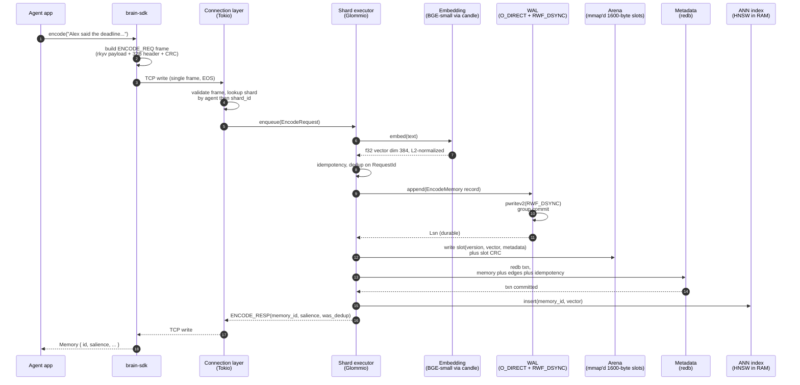
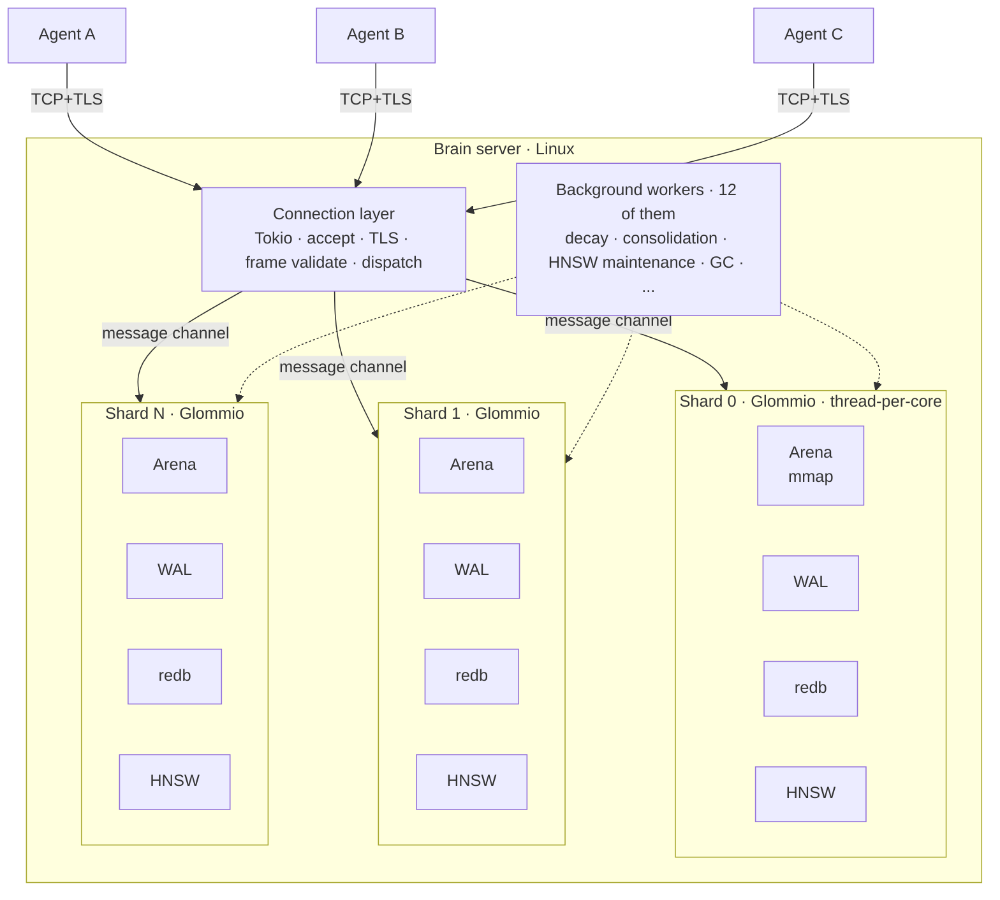
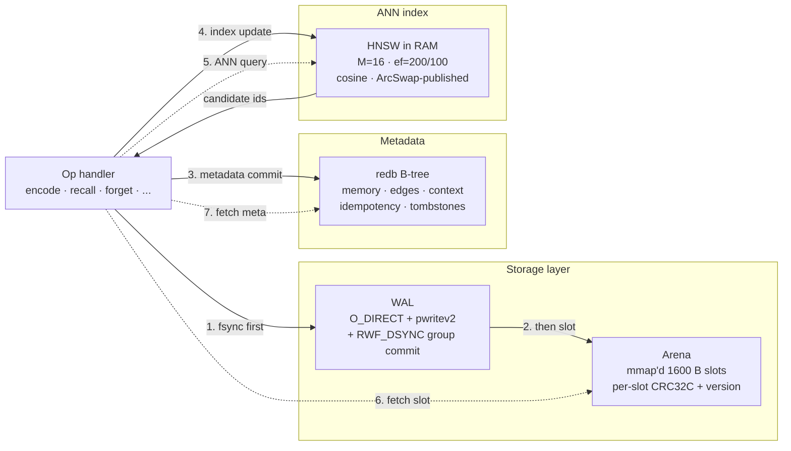

<div align="center">


</div>

# Brain

> A cognitive substrate for AI agents — a database where the primitives are *cognitive operations* (encode, recall, plan, reason, forget) instead of tables, documents, or vectors.

**Status:** Specification complete (218 spec files, ~42K lines). Implementation in progress — Phase 1 (wire protocol) shipped; Phase 2 (storage) starting.

```rust
// Encode an experience
brain.encode("Had a difficult conversation with Alex about the project").await?;

// Recall what's relevant later
let memories = brain.recall("conflicts with Alex").await?;
//   → ranked by semantic similarity, edge proximity, temporal recency,
//     and salience — not just vector distance.
```

---

## Table of contents

- [What Brain is](#what-brain-is)
- [Why this exists](#why-this-exists)
- [The cognitive primitives](#the-cognitive-primitives)
- [End-to-end: what `brain.encode("…")` actually does](#end-to-end-what-brainencode-actually-does)
- [Architecture](#architecture)
  - [System layers](#system-layers)
  - [Inside a shard](#inside-a-shard)
  - [The wire protocol](#the-wire-protocol)
- [The seven invariants](#the-seven-invariants)
- [Tech stack](#tech-stack)
- [Implementation status](#implementation-status)
- [Development environment](#development-environment)
- [Repository layout](#repository-layout)
- [Building with Claude Code](#building-with-claude-code)
- [License](#license)

---

## What Brain is

Brain is to AI agents what SQL is to applications: a substrate where the application says *what* it wants cognitively and the substrate handles *how*.

Today, building memory for an LLM agent typically looks like: glue a vector database for similarity, a graph database for relationships, a key-value store for state, a queue for async events, and write a thousand lines of orchestration to keep them in sync. Half of that orchestration is reinventing transaction semantics across systems that don't agree on what "committed" means.

Brain is one substrate. It stores text, embeddings, edges, salience, time, and provenance in a single record (the **memory**), and exposes five cognitive verbs that compose into the operations agents actually need. Recall isn't `top-k by cosine` — it's similarity *blended with* recency, salience, and edge proximity, with a typed result that the substrate can guarantee is durable, idempotent, and consistent.

Two things to know up front:

1. **The substrate owns the embedding model.** Agents send text. The substrate runs BGE-small-en-v1.5 (or a configured equivalent) and produces the vector. The model fingerprint is recorded on every memory; embedding migrations are an explicit operation, not a quiet rebuild.

2. **Brain is Linux-only.** The performance properties Brain promises rely on `io_uring`, `O_DIRECT`, `pwritev2(RWF_DSYNC)`, `mmap` + `mremap`, and a few `madvise`/`fallocate` flags that have no portable equivalent at the latency we target. See [`spec/01_system_architecture/05_hardware.md`](spec/01_system_architecture/05_hardware.md) §1.1 for the rationale, and [Development environment](#development-environment) below for non-Linux dev paths.

## Why this exists

Vector databases give you `top-k by cosine similarity` and call it done. That is not how memory works.

Real cognitive recall blends:

- **Semantic similarity** — vectors get you in the right neighborhood.
- **Temporal recency** — when something happened matters; older memories should fade unless reinforced.
- **Salience** — how important an event was to the agent (their valuation, not yours).
- **Causal/derivational structure** — graph edges (`CAUSED`, `FOLLOWED_BY`, `DERIVED_FROM`, `CONTRADICTS`, `SUPPORTS`, `REFERENCES`, `PART_OF`, `SIMILAR_TO`) give shape to a memory's neighborhood.
- **Spreading activation** — recently-accessed memories should pull in their neighbors.

Application developers shouldn't wire all of that on top of a vector DB + a graph DB + a key-value store + a queue. Brain provides one substrate that does it natively, with the durability, idempotency, and observability properties you'd expect from a database.

Substrate-owned embedding is part of the same bet: most of the hidden complexity in agentic-memory systems is reconciling embeddings produced by different model versions across stores. If the substrate owns it, the model fingerprint is intrinsic, migrations are explicit, and no two records can disagree about which space they live in.

## The cognitive primitives

Five operations cover the cognitive verbs:

| Primitive | What it does | Returns |
|---|---|---|
| `ENCODE` | Store a memory. Substrate handles embedding, slot allocation, index insertion, and edge inference. | `MemoryId`, computed salience |
| `RECALL` | Find memories matching a cue, blending similarity + recency + salience + edge proximity. Streams results. | Stream of ranked memories |
| `PLAN` | Walk a chain of memories along temporal/causal edges from a start to a goal. | Stream of plan steps |
| `REASON` | Multi-hop traversal across memory edges to produce inferences with supporting/contradicting evidence. | Stream of inference steps |
| `FORGET` | Soft tombstone (recoverable until reclamation grace expires) or hard erase. | Acknowledgment + edges removed count |

Plus `LINK`/`UNLINK` for explicit edges, `TXN_BEGIN`/`COMMIT`/`ABORT` for atomic multi-op transactions, `SUBSCRIBE`/`UNSUBSCRIBE` for event streams, and an `ADMIN_*` family (snapshot, restore, integrity-check, migrate-embeddings, reclassify, etc.).

### Sample interactions (Rust SDK shape)

```rust
// 1. Connect, identify the agent.
let brain = brain_sdk::Client::connect("brain://substrate.local:7878")
    .with_token(env!("BRAIN_TOKEN"))
    .open(agent_id)
    .await?;

// 2. Encode a conversation turn. Salience hint is optional; the
//    substrate also computes one based on novelty and edges.
let memory = brain.encode("Alex said the deadline can slip to next Friday")
    .salience(0.6)
    .edge(EdgeKind::FollowedBy, prev_turn_id)
    .await?;
println!("stored as {}, salience {:.2}", memory.id, memory.salience);

// 3. Later: recall everything related to deadlines and Alex.
let mut results = brain.recall("when did Alex change the deadline?")
    .top_k(5)
    .include_edges(true)
    .stream()
    .await?;
while let Some(r) = results.next().await {
    println!("{:.2}  {}", r.confidence, r.text);
}

// 4. Plan from "current sprint" to "shipping the feature":
let mut plan = brain.plan(
        PlanState::ByText("current sprint state".into()),
        PlanState::ByText("feature shipped".into()),
    )
    .budget(PlanBudget { max_steps: 8, max_wall_time_ms: 1_000, max_branches_explored: 50 })
    .stream()
    .await?;
while let Some(step) = plan.next().await {
    println!("step {}: {} (transition: {:?})", step.step_index, step.text, step.transition_kind);
}

// 5. Soft-forget when something becomes private:
brain.forget(memory.id, ForgetMode::Soft).await?;
```

(SDK lands in Phase 10. Today the wire protocol that powers this — the `brain-protocol` crate — is shipped and tested.)

## End-to-end: what `brain.encode("…")` actually does



The order matters. Step 5 (WAL fsync) is what makes the operation durable; the response is *not* sent until that fsync returns. Steps 6–9 happen after but before the response — if any of them fail, the WAL record is the source of truth and recovery replays it. This is the "WAL-before-acknowledge" invariant — see [the seven invariants](#the-seven-invariants).

## Architecture

### System layers



Two runtimes, one host:

- **Connection layer** runs on **Tokio**. Many lightweight tasks: accept TCP, terminate TLS, decode the 32-byte frame header, validate, dispatch to the right shard via a bounded message channel. Tokio is great here — many tasks, varied shapes, async I/O.
- **Shard layer** runs on **Glommio**. Thread-per-core, `io_uring`, single-task-per-shard for the writer. Each shard owns its files, its index, its caches. No cross-shard locks. Reads use `ArcSwap` + `crossbeam-epoch` for lock-free hot paths.

The two layers communicate via channels carrying *messages* (plain `Send` structs). Per-shard data never crosses the boundary; the connection task hands off an `EncodeRequest`, the shard hands back an `EncodeResponse`.

Sharding is by agent (`AgentId → ShardId`), so every operation for an agent goes to one shard. That makes the shard's discipline easy to reason about: one writer, no locks needed, no cross-shard coordination on the hot path.

**Twelve background workers** keep the substrate healthy: salience decay over time, consolidation (multiple similar memories → one summary), HNSW link maintenance, slot reclamation past the tombstone grace window, idempotency-table TTL expiry, and so on. Workers run as their own Glommio tasks, scheduled around the per-shard writer.

### Inside a shard



Four data structures per shard, each pinned to a spec section:

- **Arena** ([`spec/05/02`](spec/05_storage_arena_wal/02_arena_layout.md)) — memory-mapped file of 1600-byte slots. Each slot is 1536 bytes of `f32` vector (384 × 4) plus 64 bytes of metadata (kind, salience, timestamps, slot version, CRC). The file has a 4 KiB header recording the shard UUID, format version, slot count, embedding-model fingerprint, and a header CRC. Vectors are little-endian on disk.
- **WAL** ([`spec/05/04..08`](spec/05_storage_arena_wal/04_wal_overview.md)) — append-only log of operations, one segment per ~64 MiB. Writes use `O_DIRECT` for predictable latency and `pwritev2(RWF_DSYNC)` for durable fsync; the WAL also batches concurrent writes via group commit so N pending records share one fsync. Recovery replays from the last checkpoint forward, tolerating torn-tail (the last record may be partial; we stop there).
- **redb** ([`spec/07`](spec/07_metadata_graph/02_table_layout.md)) — embedded B-tree for metadata: text bodies, edge lists, context names, the idempotency dedupe table, tombstone records. ACID transactions wrap multi-table writes from a single op.
- **HNSW** ([`spec/06`](spec/06_ann_index/02_parameters.md)) — Hierarchical Navigable Small World index for ANN search. `M=16`, `ef_construction=200`, cosine distance over L2-normalized vectors. Held in RAM; persisted incrementally; published to readers via `ArcSwap`.

The discipline that makes this work without per-record locking:

1. **Single writer per shard.** Only one task mutates shard state. Other Glommio tasks may *read* via `ArcSwap`-published snapshots (HNSW) or via the mmap (arena, redb). The writer never blocks on a lock because there's nobody to lock against.
2. **WAL-before-ack.** Step 1 in the diagram: the WAL append + fsync happens before any other store is touched. If the process dies at step 2, the WAL record on restart drives the rest.
3. **CRC on every slot, every record.** Two checksums: arena slot CRC32C catches in-flight slot corruption; WAL record CRC32C catches log corruption. Both halt the shard on mismatch — never overwrite a stored CRC.

### The wire protocol

Brain ships a custom binary protocol over TCP (with optional TLS). The 32-byte frame header is fixed; the payload is rkyv-encoded structured data plus optional raw `f32` vector blobs.

```text
 Frame header (32 bytes, big-endian)
+--------+--------+--------+--------+
| magic = "BRN0"                     |
+--------+--------+--------+--------+
| ver(1) | op(1)  | flags  (2)      |
+--------+--------+--------+--------+
| header_crc32c (4)                  |
+--------+--------+--------+--------+
| stream_id (4)                      |
+--------+--------+--------+--------+
| payload_len (3) | reserved(1)      |
+--------+--------+--------+--------+
| payload_crc32c (4)                 |
+--------+--------+--------+--------+
| reserved (8)                       |
+--------+--------+--------+--------+

 Payload layout
+----------------------------------+
| rkyv-encoded body                 |  — request/response/event struct
+----------------------------------+
| padding (0–3 bytes)               |  — align next section to 4 bytes
+----------------------------------+
| raw f32 vectors (N × 1536 bytes)  |  — optional; bytemuck::cast_slice<u8, f32>
+----------------------------------+
```

Forty-nine opcodes are defined ([`spec/03/05`](spec/03_wire_protocol/05_opcodes.md)) covering cognitive ops, transactions, subscriptions, stream control, admin operations, and connection management (HELLO/WELCOME/AUTH/AUTH_OK/PING/PONG/BYE). Validation is layered ([`spec/03/11`](spec/03_wire_protocol/11_validation.md)): frame-level (magic, version, CRC, length), payload-level (rkyv structural validation, vector norm checks), and operation-level (per-opcode field constraints).

Errors come back as a typed `ERROR` frame with a category (`Protocol`, `Authentication`, `Validation`, `NotFound`, `Conflict`, `ResourceExhausted`, `Internal`, `Unavailable`) and a stable code drawn from the [§10 error table](spec/03_wire_protocol/10_errors.md). The category drives the SDK's retry policy.

## The seven invariants

Non-negotiable rules. Code that violates them is wrong, regardless of test results.

| # | Invariant | What it prevents |
|---|---|---|
| 1 | **WAL-before-acknowledge.** No operation returns success until its WAL record is fsynced. | Lost writes after a crash. |
| 2 | **Single writer per shard.** No locks needed; the discipline enforces it. | Lock contention on the hot path; two-writer races. |
| 3 | **CRC everywhere.** Every WAL record, every arena slot. Reads verify; mismatches halt. | Silent corruption from bad disk / memory / cosmic ray. |
| 4 | **Slot version on `MemoryId`.** Encoded in the ID; stale references → `NotFound`. | Reading the wrong memory after slot reuse. |
| 5 | **Idempotency by `RequestId`.** 24h TTL. Same params → cached response. Different params → `Conflict`. | Duplicate effects on retry. |
| 6 | **Tombstone grace before reclamation.** Default 7 days. Hard FORGET zeroes immediately. | Surprise: data still recoverable when soft-forgotten / data lingers when hard-forgotten. |
| 7 | **No silent corruption.** Fail-stop and alert. Never return wrong data. | Trusting outputs that may be wrong; quietly papering over bit rot. |

Tested per [`spec/16/06 durability_criteria.md`](spec/16_benchmarks_acceptance/06_durability_criteria.md). Phase 2's random-kill test exercises 1, 2, 3, 5, and 7 directly; Phase 8's GC tests cover 4 and 6.

## Tech stack

| Component | Crate | Why |
|---|---|---|
| Async runtime (shards) | [`glommio`](https://github.com/DataDog/glommio) | Thread-per-core, `io_uring`, no work-stealing — predictable per-core latency. |
| Async runtime (connection layer) | [`tokio`](https://tokio.rs) | Many tasks, varied shapes, mature ecosystem. |
| Wire encoding | [`rkyv`](https://github.com/rkyv/rkyv) + [`bytemuck`](https://github.com/Lokathor/bytemuck) | Zero-copy structured deserialization (rkyv) + raw vector slice access (bytemuck::cast_slice). |
| Metadata store | [`redb`](https://github.com/cberner/redb) | Pure-Rust ACID B-tree; embeddable; no external services. |
| ANN index | [`hnsw_rs`](https://github.com/jean-pierreBoth/hnswlib-rs) | HNSW; battle-tested parameters (M=16, ef=200/100). |
| Embedding | [`candle`](https://github.com/huggingface/candle) family + [`tokenizers`](https://github.com/huggingface/tokenizers) | Pure-Rust inference; BGE-small-en-v1.5; substrate-owned. |
| SIMD math | [`matrixmultiply`](https://github.com/bluss/matrixmultiply) + [`wide`](https://github.com/Lokathor/wide) | Cosine distance kernel; portable AVX2 / NEON fallbacks. |
| Lock-free swap | [`arc-swap`](https://github.com/vorner/arc-swap) | Cross-shard read snapshots without locking. |
| Epoch GC | [`crossbeam-epoch`](https://docs.rs/crossbeam-epoch) | Safe memory reclamation for lock-free reads. |
| CRC | [`crc32c`](https://docs.rs/crc32c) | iSCSI Castagnoli polynomial; hardware-accelerated. |
| UUIDs | [`uuid`](https://docs.rs/uuid) (v7) | Time-ordered IDs; agents/contexts/requests/transactions. |
| Errors | [`thiserror`](https://docs.rs/thiserror) (libs) + [`anyhow`](https://docs.rs/anyhow) (bins) | Typed errors at boundaries, ergonomic at the top. |
| Telemetry | [`tracing`](https://docs.rs/tracing) + [`opentelemetry`](https://opentelemetry.io) | Spans, structured fields, OTel export. |

Deps are pinned in the workspace `Cargo.toml`; new ones require justification per [`AUTONOMY.md`](AUTONOMY.md) §2.6.

## Implementation status

The 17-document specification is **complete** (~42K lines). Implementation is phased:

| Phase | Scope | Status |
|---|---|---|
| 0 | Workspace skeleton, CI | ✓ tagged `phase-0-complete` |
| 1 | Wire protocol & core types | ✓ tagged `phase-1-complete` (122 tests, 3 fuzz targets, ~67M fuzz runs zero panics) |
| 2 | Storage: arena + WAL + recovery | ☐ planning complete; starting |
| 3 | Metadata + redb integration | ☐ |
| 4 | ANN index (HNSW) | ☐ |
| 5 | Embedding service | ☐ |
| 6 | Query planner | ☐ |
| 7 | Cognitive operations | ☐ |
| 8 | Background workers | ☐ |
| 9 | Server binary (Tokio + Glommio wiring) | ☐ |
| 10 | SDK + admin CLI | ☐ |
| 11 | Observability + benchmarks | ☐ |

See [`ROADMAP.md`](ROADMAP.md) for the high-level index and [`docs/phases/`](docs/phases/) for per-phase sub-task breakdowns. Per-phase plans (with web-validated external choices, trade-offs, risks, and test plans) are recorded in [`.claude/plans/`](.claude/plans/) as durable design ADRs.

## Development environment

**Linux x86_64 / aarch64, kernel ≥ 5.15.** Brain depends on `io_uring`, `O_DIRECT`, `pwritev2(RWF_DSYNC)`, and a few Linux-only `madvise` / `fallocate` flags — see [`spec/01_system_architecture/05_hardware.md`](spec/01_system_architecture/05_hardware.md) §1.1 for why we chose a single-platform backend over portable shims.

### What compiles where

| Crate | Linux | macOS / Windows native |
|---|---|---|
| `brain-core` | ✓ | ✓ (pure value types) |
| `brain-protocol` | ✓ | ✓ (codec only) |
| `brain-cli` | ✓ | ✓ (no runtime dep yet) |
| `brain-sdk-rust` | ✓ | ✓ (client-side) |
| `brain-storage` | ✓ | ✗ — `compile_error!` |
| `brain-metadata` | ✓ | ✗ once redb is wired with `O_DIRECT`-aware paths (Phase 3) |
| `brain-index` | ✓ | ✗ once HNSW persistence lands (Phase 4) |
| `brain-embed` | ✓ | ✗ once candle wiring lands (Phase 5) |
| `brain-planner` | ✓ | ✓ (pure logic) |
| `brain-ops` | ✓ | △ partial — wires runtime crates |
| `brain-workers` | ✓ | ✗ — runs on Glommio |
| `brain-server` | ✓ | ✗ — Glommio + Tokio runtime |

CI (`.github/workflows/ci.yml`) runs everything on `ubuntu-latest` and is the authoritative test gate.

### Native Linux

```bash
rustup toolchain install stable
rustup component add rustfmt clippy
just verify
```

### macOS / Windows — dev container (recommended)

The repo ships a `.devcontainer/` config. With Docker, OrbStack, or Colima running:

```bash
just shell        # builds the image on first run, drops you into bash
# inside the container:
just verify
```

Editor integration: VS Code, Cursor, JetBrains, and GitHub Codespaces auto-detect `.devcontainer/devcontainer.json`. Use "Reopen in Container."

#### Container runtime notes

| Runtime | macOS recommendation |
|---|---|
| **OrbStack** | Recommended on Apple Silicon. Permissive seccomp; works with `io_uring` (relevant from Phase 9). |
| **Docker Desktop** | Works for Phase 2 (`pwritev2`/`mmap`/`mremap` aren't blocked). Phase 9 will need a custom seccomp profile or `--security-opt seccomp=unconfined` since 4.42+ blocks `io_uring`. |
| **Colima** | Works similarly to Docker Desktop; uses Lima/QEMU. |

#### Container caveats

- **`O_DIRECT` against bind-mounted source.** macOS-hosted Docker mounts via VirtioFS / 9P; these may not support `O_DIRECT`. Storage tests should write under `/tmp` (tmpfs) or a named-volume path inside the container — not `/workspaces/brain` (the bind mount).
- **First build is slow** (downloads ~100 crates). Persistent named volumes (`brain-cargo-registry`, `brain-cargo-git`, `brain-target-cache`) keep the cache across container restarts.
- **`io_uring` in Docker Desktop 4.42+** is blocked by default seccomp. Doesn't bite Phase 2; will need attention in Phase 9.

### macOS / Windows — cross-compile-only

Validates compilation without running. Pair with the dev container (or CI) for actual tests.

```bash
rustup target add x86_64-unknown-linux-gnu
brew install lld   # or: cargo install --locked cargo-zigbuild

# .cargo/config.toml (gitignored):
# [target.x86_64-unknown-linux-gnu]
# linker = "x86_64-linux-gnu-gcc"   # or "ld.lld"

cargo check --workspace --target x86_64-unknown-linux-gnu
```

### Common commands

```bash
just verify                                                       # full verify: fmt + build + clippy + test + check-skills
cargo test -p brain-protocol                                      # per-crate (cross-platform crates)
cargo run --bin brain-server -- --config config/dev.toml          # Linux only
cargo run --bin brain-cli -- stats                                # cross-platform
cargo +nightly fuzz run protocol_frame -- -max_total_time=60      # nightly + Linux
just shell                                                        # enter the dev container (Docker required)
```

### When something doesn't work

- **`liburing-sys` link error on macOS native:** expected. Use the dev container.
- **`compile_error!` mentioning README.md:** the friendly Linux gate; switch to the container.
- **`io_uring_setup: Function not implemented`:** kernel too old or seccomp restricted; check host kernel and container runtime.
- **`O_DIRECT` returns `EINVAL`:** the filesystem under the test path doesn't support direct I/O; use `/tmp` or a named volume.

## Repository layout

```
brain/
├── README.md                     # This file (single source of setup truth)
├── CLAUDE.md                     # Context loaded by Claude Code each session
├── AUTONOMY.md                   # Autonomous-mode operating contract
├── ROADMAP.md                    # High-level phase index
├── .claude/                      # Claude Code project config
│   ├── settings.json             #   tool permissions + hooks wiring
│   ├── hooks/                    #   PreToolUse safety scripts
│   ├── commands/                 #   custom slash commands
│   ├── agents/                   #   specialized subagents
│   ├── skills/                   #   23 skills: rust core (vendored) + Brain-specific
│   └── plans/                    #   per-phase ADRs (substantial sub-task design records)
├── .devcontainer/                # Linux dev container for non-Linux contributors
│   ├── Dockerfile
│   ├── devcontainer.json
│   └── post-create.sh
├── docs/
│   └── phases/                   # Per-phase detailed sub-task plans
│       ├── README.md
│       ├── phase-01-wire-protocol.md
│       ├── ...
│       └── phase-11-observability.md
├── spec/                         # The 17-document specification (read-only)
│   ├── 00_master_overview/
│   ├── 01_system_architecture/
│   ├── 02_data_model/
│   ├── 03_wire_protocol/
│   ├── 05_storage_arena_wal/
│   └── ... (218 files, ~42K lines)
├── crates/
│   ├── brain-core/               # Shared value types
│   ├── brain-protocol/           # Wire codec
│   ├── brain-storage/            # Arena + WAL + recovery (Linux only)
│   ├── brain-metadata/           # redb wrapper
│   ├── brain-index/              # HNSW
│   ├── brain-embed/              # BGE inference
│   ├── brain-planner/            # Query planner
│   ├── brain-ops/                # Cognitive operations
│   ├── brain-workers/            # Background workers
│   ├── brain-server/             # Server binary
│   ├── brain-sdk-rust/           # Rust SDK
│   └── brain-cli/                # Admin CLI
├── fuzz/                         # cargo-fuzz harnesses (3 targets)
├── scripts/
│   └── check-skills.sh           # Skill frontmatter linter
├── config/                       # Example TOML configs
├── justfile                      # Convenience commands (`just verify`, `just shell`, ...)
└── .github/workflows/ci.yml      # CI: build + test + clippy + fmt + miri + audit
```

## Building with Claude Code

This repository is configured for development with [Claude Code](https://claude.com/claude-code), including an **autonomous operating mode** for hands-off implementation through the roadmap.

The `.claude/` folder ships:

- **`settings.json`** — tool permissions and pre-tool-use hooks.
- **`hooks/`** — safety scripts that block destructive operations even with permissions skipped.
- **`commands/`** — slash commands: `/spec`, `/next-task`, `/status`, `/commit-task`, `/verify`, `/lint`, `/bench`, `/audit-spec`, `/new-crate`.
- **`agents/`** — specialized subagents: `spec-navigator`, `rust-implementer`, `test-engineer`.
- **`skills/`** — 23 skills (5 vendored from `actionbook/rust-skills`, 1 from `anthropics/skills`, 17 project-specific) covering Rust discipline (unsafe-checker, anti-pattern, perf, error-handling, concurrency), Brain invariants (CLAUDE.md §5 audit, spec-MUST verification, wire-version-bump detection), runtime split (Glommio rules, Tokio↔Glommio boundary), storage (WAL audit, arena audit, redb schema, zero-copy review), index tuning (HNSW), testing (fuzz targets, loom design, chaos tests), and observability (tracing, perf-target audit).
- **`plans/`** — durable ADRs for substantial sub-tasks. Each plan covers scope, spec references, web-validated external choices, architecture sketch, trade-offs, risks, and test plan.

Three top-level docs work together:

- **[`CLAUDE.md`](CLAUDE.md)** — project context loaded on every session.
- **[`AUTONOMY.md`](AUTONOMY.md)** — operating contract for autonomous mode (execution loop, hard rules, plan-first workflow, stop conditions). **Read before running with `--dangerously-skip-permissions`.**
- **[`ROADMAP.md`](ROADMAP.md)** + **[`docs/phases/`](docs/phases/)** — twelve phases, each with a per-sub-task breakdown.

### Quick start

```bash
git clone https://github.com/brain-db-io/brain-db.git brain && cd brain
just verify                      # cargo build + test + clippy + fmt + skills
git tag phase-0-complete         # if not already tagged

# Open Claude Code (interactive)
claude

# Or autonomous mode — Claude works through the roadmap unattended
claude --dangerously-skip-permissions
```

### Common slash commands

```
/status                # phase progress, last commit, next sub-task, health
/next-task             # propose the next sub-task with reads/writes/criteria
/spec 05 08            # navigate spec § 05 (storage), file 08 (recovery)
/verify                # run full verify suite
/commit-task 1.3 ...   # commit current work with the prescribed message format
/audit-spec brain-protocol  # check implementation against spec
```

### How autonomous mode works

In autonomous mode, Claude executes the loop in [`AUTONOMY.md`](AUTONOMY.md) §1: read state, pick the lowest unfinished sub-task in the active phase doc, **draft a plan in `.claude/plans/` and surface for confirmation** if the sub-task is substantial (per §21), implement, verify, commit, repeat. On any uncertainty, Claude stops and writes `CONTEXT.md` describing the situation rather than guessing.

The pre-tool-use hooks in `.claude/hooks/` provide a safety net: even with permissions skipped, Claude cannot `rm -rf /`, `git push --force`, `cargo publish`, edit files in `spec/`, or run `sudo`. Edit the hooks to adjust.

## License

[Apache-2.0](LICENSE). Source code, spec, plans, and skills are all under the same license.

By submitting a pull request, you agree that your contribution is licensed under the Apache-2.0 terms (per Apache-2.0 §5 — "Submission of Contributions"). The Apache-2.0 patent grant applies; see [LICENSE](LICENSE) for details.

Repository: <https://github.com/brain-db-io/brain-db>
